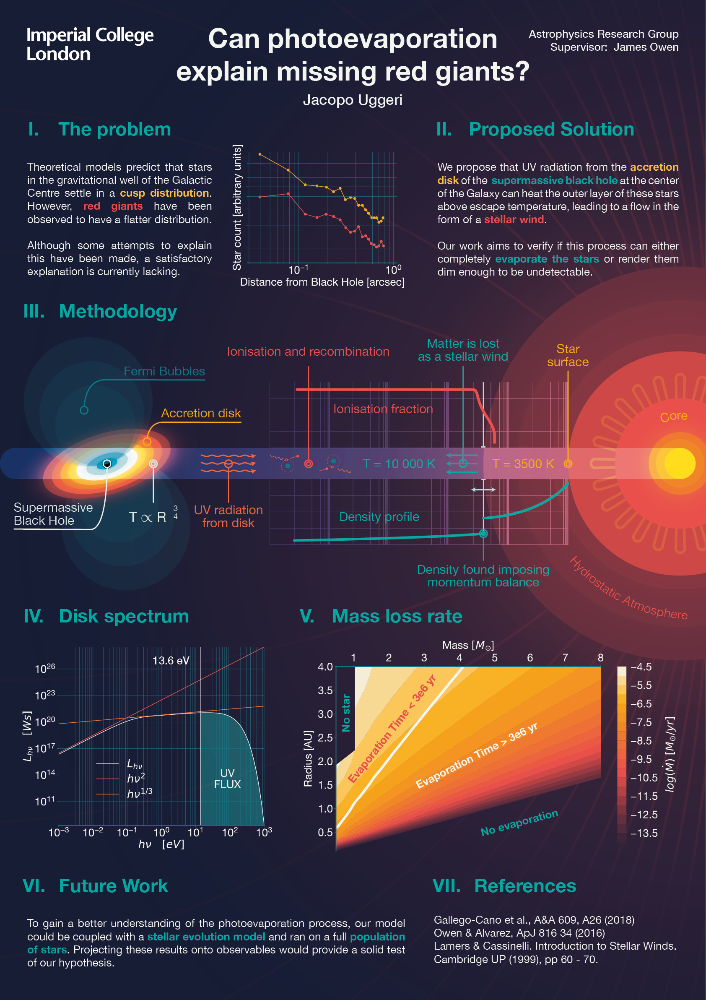

# Can photoevaporation explain missing red giants at the centre of the Galaxy?

This is the code for my MSci research project. Video explanation on [YouTube](
https://youtu.be/rkd852yk1FY).

# Project Poster

